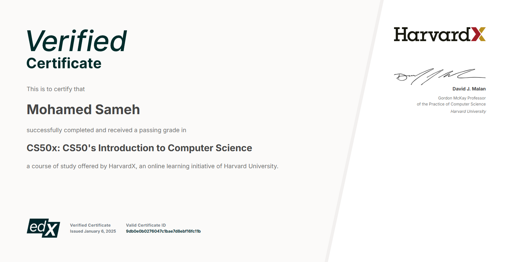

# CS50-Projects

A collection of all my foundational CS50 projects.

This repository contains all the problem sets I have completed as part of the Harvard CS50x course. Each problem set is stored in its own folder and includes all the necessary files and documentation.

## Certificate

## Problem Sets:

  
### Problem Set 1: [C](https://cs50.harvard.edu/x/2025/psets/1/)
- **Description**: A continuation of learning C and algorithms.
- **Files**:
  - `cash.c`
  - `credit.c`
  - `greedy.c`

### Problem Set 2: [Arrays](https://cs50.harvard.edu/x/2025/psets/2/)
- **Description**: Arrays and more complex algorithms.
- **Files**:
  - `caesar.c`
  - `substitution.c`

### Problem Set 3: [Algorithms](https://cs50.harvard.edu/x/2025/psets/3/)
- **Description**: Introduction to sorting and searching algorithms.
- **Files**:
  - `plurality.c`
  - `runoff.c`

### Problem Set 4: [Memory](https://cs50.harvard.edu/x/2025/psets/4/)
- **Description**: Working with memory, pointers, and dynamic memory allocation.
- **Files**:
  - `resize.c`

### Problem Set 5: [Data Structures](https://cs50.harvard.edu/x/2025/psets/5/)
- **Description**: Implementing data structures like linked lists and hash tables.
- **Files**:
  - `speller.c`

### Problem Set 6: [Python](https://cs50.harvard.edu/x/2025/psets/6/)
- **Description**: Introduction to Python and problem solving.
- **Files**:
  - `dictionary.py`
  - `populate.py`

### Problem Set 7: [SQL](https://cs50.harvard.edu/x/2025/psets/7/)
- **Description**: Introduction to databases and SQL.
- **Files**:
  - `pokedex.py`
  - `store.py`

### Problem Set 8: [Final Project]
- **Description**: The final project, where you design a full-fledged application.
  - *(Files for this project are not here due to privacy reasons.)*
  
---

## How to Run the Projects

Each problem set contains specific instructions for how to run the code. Typically, these steps involve compiling and executing C code or running Python scripts. Follow the README or documentation provided with each individual project.

---

## License

This repository is maintained by Mohamed Sameh as part of Harvard’s CS50x course.

